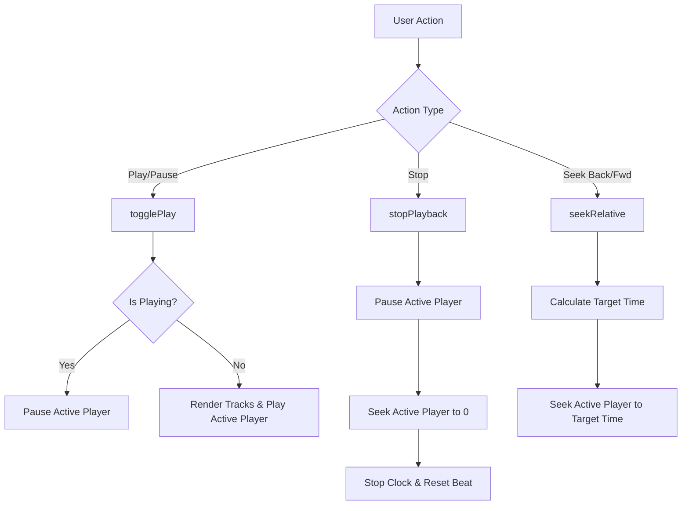

# OpenSpec Design: Unified Audio Transport System

This document outlines the detailed design, state flow, and component wiring for the unified play, stop, rewind, and fast-forward transport functions.

---

## 1. State Flow Diagram



---

## 2. API Contract & Implementation Detail

### 2.1. Helpers Signature in `app/studio/[id].tsx`

```typescript
const seekRelative = (seconds: number): void => {
  if (isWeb) {
    webAudio.seekTo(Math.max(0, webAudio.currentTime + seconds));
  } else if (player) {
    player.seekTo(Math.max(0, (status.currentTime || 0) + seconds));
  }
};

const stopPlayback = (): void => {
  if (isWeb) {
    webAudio.pause();
    webAudio.seekTo(0);
  } else if (player) {
    player.pause();
    player.seekTo(0);
  }
  stopClock();
  setCurrentBeat(0);
};
```

---

## 3. UI Component Mapping

```text
+-------------------------------------------------------+
|  ⏮ [seekRelative(-5)]                                 |
|  ▶/⏸ [togglePlay()]                                   |
|  ⏹ [stopPlayback()]                                   |
|  ⏭ [seekRelative(5)]                                  |
|  Time: {formatTime(currentTime)} / {formatTime(duration)} |
+-------------------------------------------------------+
```
- **Rewind Control**: Wraps the `⏮` icon. Triggers `seekRelative(-5)` on press.
- **Play/Pause Control**: Triggers `togglePlay()`. Text state toggles between `▶` and `⏸`.
- **Stop Control**: Wraps the `⏹` icon. Triggers `stopPlayback()` on press.
- **Fast-Forward Control**: Wraps the `⏭` icon. Triggers `seekRelative(5)` on press.
